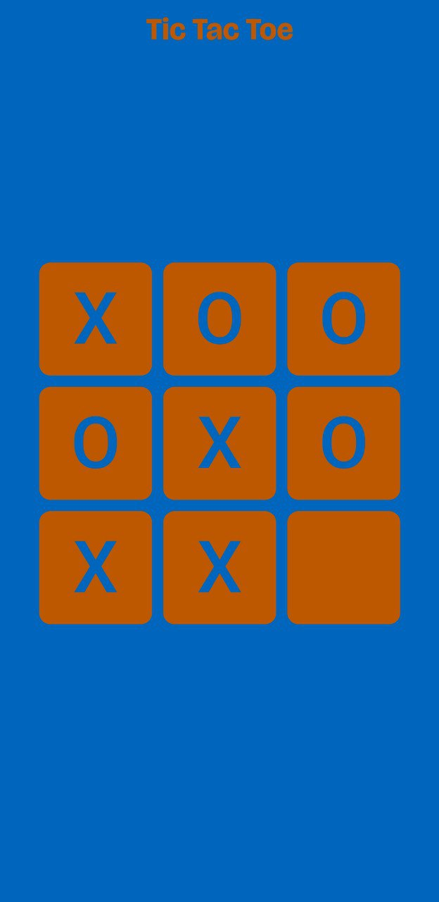
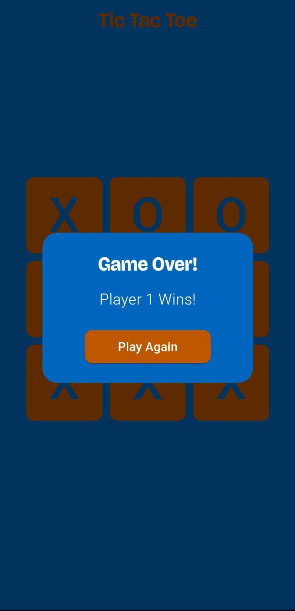

# 🎮 Flutter Tic Tac Toe

A simple, modern **Tic Tac Toe** game built using **Flutter**.  
---

## 🧩 Features

- 🎨 Clean and responsive UI  
- ✖️🟢 Player 1 (X) vs Player 2 (O)  
- 🏆 Winner detection and draw handling  
- 🔁 Restart game after each round   

---

## 📱 Screenshots

| Gameplay | Game Over Dialog |
|-----------|------------------|
|  |  |

---

## 🚀 Getting Started

### 1️⃣ Clone the repository

```bash
git clone https://github.com/yourusername/flutter-tic-tac-toe.git
